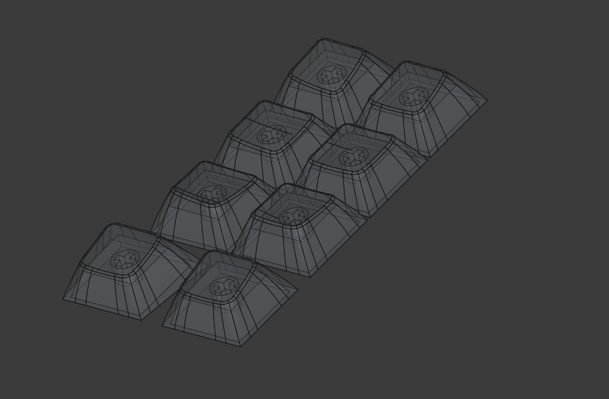
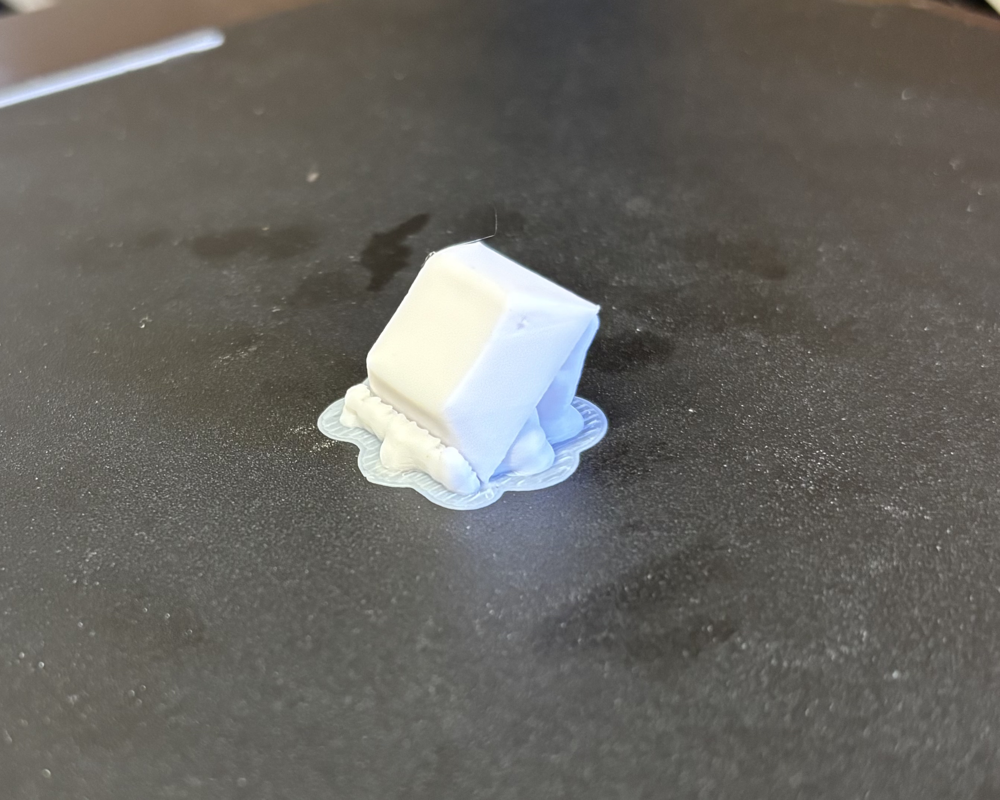
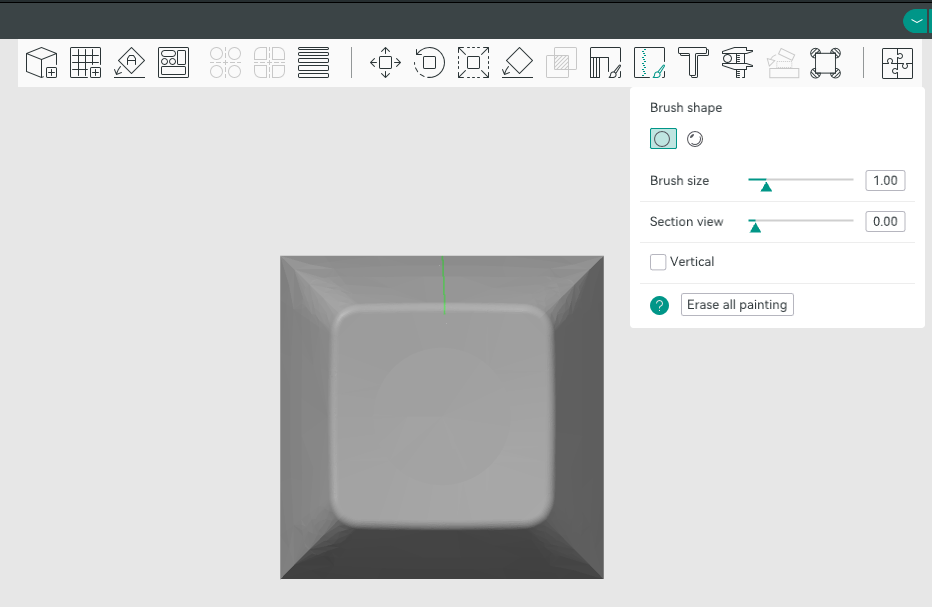
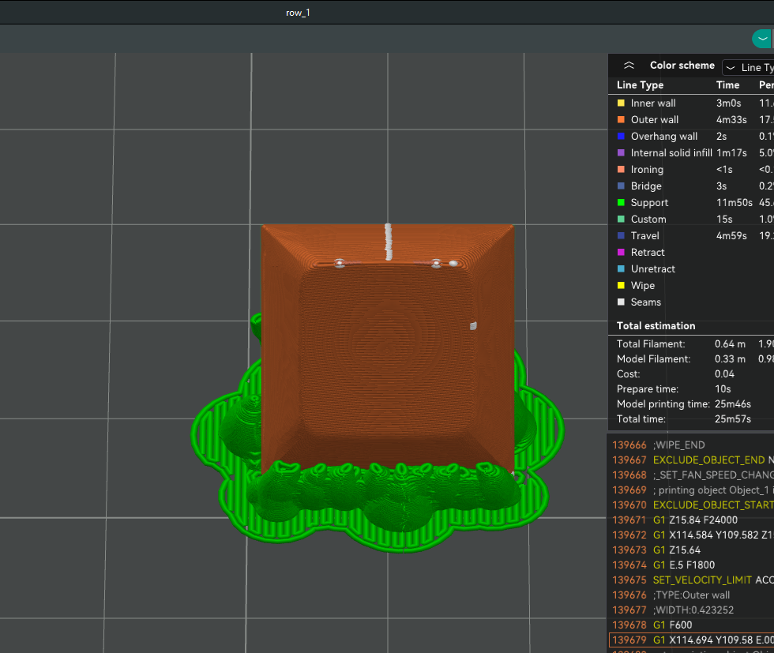

# Eriks Sculpted Keycaps

A set of sculpted keycaps designed using [freecad](https://www.freecad.org/)

The thumb cluster keys are designed to match my keyboard [ermbkbd](https://github.com/erikpeyronson/ermbkbd)

The set in the pictures were printed on a 45 degree angle with 0.08 layer height using a Creality Ender 3v3 ke using white Sunlu pla+ filament. Sliced with Orca slicer

After printing they were sanded using a dremel with 180 grit disk and finished of with 400 grit sandpaper

# Images

# Notes

The slicer wanted to place the seam for the top layers on a corner which resulted in ugly marks.

This can be avoided by manually moving the seam to the back of the cap when slicing. It's still be visable but a lot less prominent and facing away you wont see it when typing.

